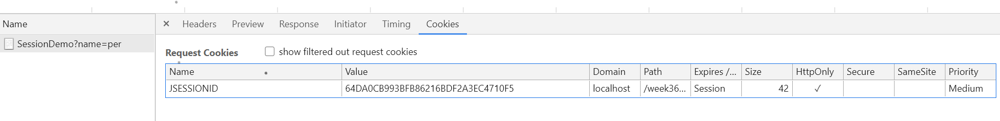
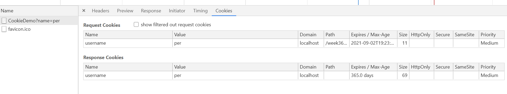

## Monitoring HTTP Headers 1

**1. Observe and explain each of the values monitored (use view source to see the plain messages)**

I netværksfanen kan vi se en fil - i mit tilfælde */week36_day2_part1"*.
I fanen kan vi se statuskode 200, som betyder alt ok.

I fanen *"Sources"* kan vi se en folderr-struktur med de samme filer.

**2) Monitoring HTTP Headers 2**

Efter at havde tilføjet .css og et billede til websiden, kan vi under fanen netværk undersøge headers for hver fil.
Under "General" på de enkelte filer kan vi se indformationer som request URL, request method (GET) og statuskode (200).
Desuden kan vi se responce headers og request headers.
Alle disse siger noget om hvordan klienten og serveren kommunikere.

**3) Monitoring HTTP Headers 3  (Response-codes 3xx)**

Åbner vi vores side `http://localhost:8080/week36_day2_part1/` kan vi tilgå vores "index" -side.
Skriver vi `http://localhost:8080/week36_day2_part1/redirect` kan vi se to filer i netværksfanen.

- r.html: den side vi oprettede.
- redirect: Kan se i headeren at der er tale om en 302 - en-redirect. I responce header kan vi desuden se `location: r.html`. Serveren re-directer request fra `http://localhost:8080/week36_day2_part1/redirect` til `http://localhost:8080/week36_day2_part1/r.html`.

**3a) Redirecting to HTTPs instead of HTTP**

Den første responce bliver håndteret medstatus 302 - en re-direct.
I responce header kan vi se https under location.

Den næste request på listen er med status 200 som er https version af siden vi ender på.

**4a. Status Codes (5xx)**

Serveren genererer en 500 fejlkode med følgende stacktrace fra TomCat

```java
java.lang.ArithmeticException: / by zero
	Ups.processRequest(Ups.java:34)
	Ups.doGet(Ups.java:61)
	javax.servlet.http.HttpServlet.service(HttpServlet.java:626)
	javax.servlet.http.HttpServlet.service(HttpServlet.java:733)
	org.apache.tomcat.websocket.server.WsFilter.doFilter(WsFilter.java:53)
```
**4b. Status code (400)**

Serveren genererer en 404 fejlkode med følgende besked
``The origin server did not find a current representation for the target resource or is not willing to disclose that one exists.``

**4c) Status Codes - Ranges**

- 2xx = Succes
- 3xx = Redirection
- 4xx = Client errors
- 5xx = Server errors

**5) Get HTTP Request Headers on the Server**

Løst med java som dette.

Her bliver det udskrevet i konsol:
```java
Enumeration<String> headerNames = request.getHeaderNames();
while (headerNames.hasMoreElements()) {
    String headerName = headerNames.nextElement();
    System.out.println("Header Name - " + headerName + ", Value - " + request.getHeader(headerName));
}
```
eller udskrevet i table på siden:
```java
out.println("<table border=\"1\">");
out.println("<tr><th>Header</th><th>Value</th></tr>");
while (headerNames.hasMoreElements()) {
    String headerName = headerNames.nextElement();
    out.println("<tr><td>" + headerName + "</td><td>" + request.getHeader(headerName) + "</td></tr>");
}
out.println("</table>");
```

**6) Get/Post-parameters**

Ved at submitte en form som bruger "GET" kan form parametrene ses i URL. I dette tilfælde som
``http://localhost:8080/week36_day2_part1/opg6.html?fname=John&lname=Doe&hidden=12345678#``

Ændres formens metode til "POST" vil de indtastede data fremgå af "Form Data" som kan ses i "Network" tools.

**7) Sessions (Session Cookies)**

Den nuværende "state" opretholdes via. en session-cookie som set på nedestående billede.



Slettes denne session-cookie vil formularen dukke op igen, og der kan tastes et nyt navn.

**8) Persistent Cookies**

I nedenstående billede kan vi se cookie oplysningerne



Man kan se at den cookie der er blevet sat først udløber om 365 dage.